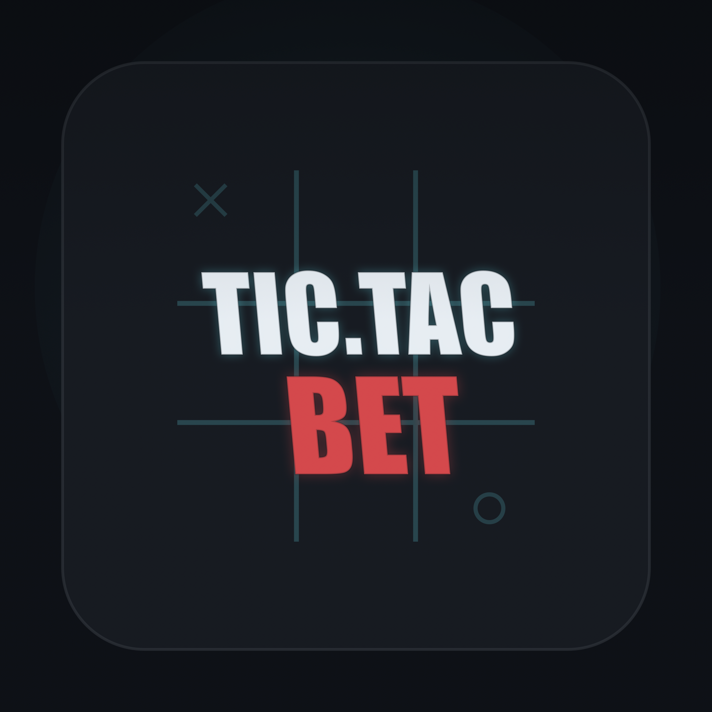
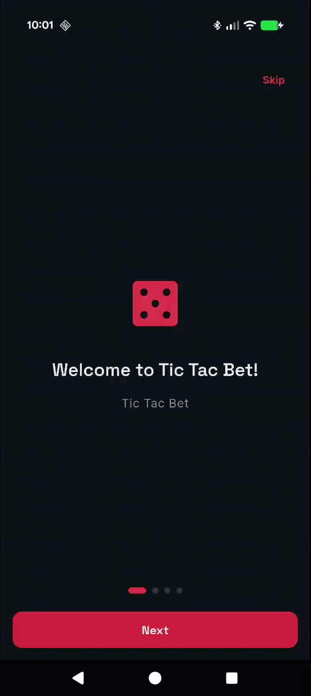
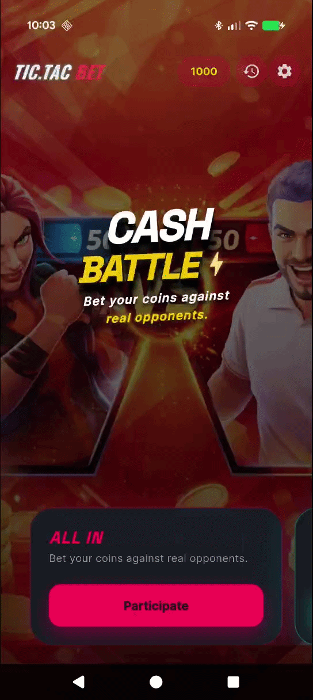
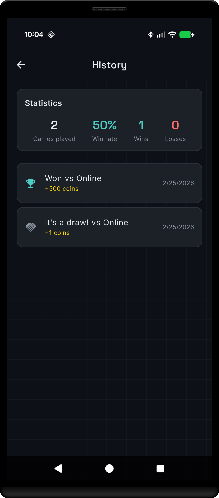
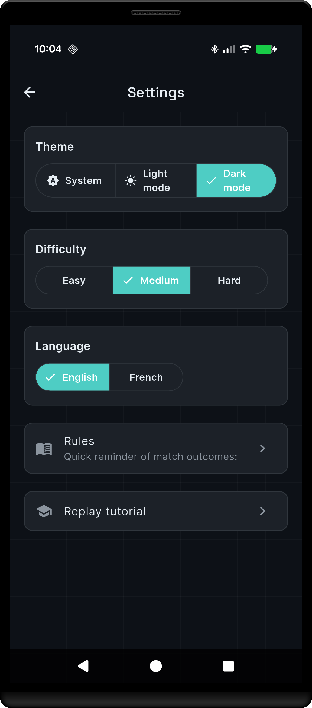

# Tic Tac Bet 🎲

<div align="center">
  
</div>

Une application de morpion avec système de paris développée avec Flutter.

## ✨ Fonctionnalités

### 🎯 Modes de jeu

- **Entraînement local** : jouer contre l'IA (facile / moyen / difficile) ou à 2 joueurs sur le même appareil
- **Battle / compétition** : poser une mise avant la partie et affronter un adversaire via le matchmaking

### 🤖 Intelligence artificielle

- Trois niveaux de difficulté : `easy`, `medium`, `hard`
- Mode `hard` basé sur l'algorithme **Minimax**
- Détection automatique victoire / égalité

### 💰 Betting & progression

- Wallet local avec solde de coins
- Mise configurable avant chaque partie
- Résolution automatique des gains et pertes
- Historique complet des parties avec statistiques

### 🎓 Onboarding interactif

- Tutoriel guidé au premier lancement
- Simulation de partie avec **coach marks** animés
- Récompense de bienvenue (1 000 coins)
- Relançable depuis les paramètres

### 🏠 Home & UX

- Cards animées par mode de jeu
- Fond visuel animé (crossfade + parallax + Ken Burns)
- Pattern graphique sur les écrans secondaires

### 🔁 Matchmaking (mock)

- Lobby avec propositions de matchs
- Création et acceptation d'une proposition
- Attente d'adversaire simulée
- Architecture prête pour remplacement par Supabase temps réel

## 🎬 Démonstrations

### Onboarding & simulation



### Home avec Kenburns / Parallax


### Parcours jusqu'à victoire



### Historique & statistiques

 -->

### Paramètres

 -->

## 📦 Dépendances principales

- **[flutter_riverpod](https://pub.dev/packages/flutter_riverpod)** + **[riverpod_generator](https://pub.dev/packages/riverpod_generator)** : gestion d'état réactive avec code generation
- **[freezed](https://pub.dev/packages/freezed)** + **[json_serializable](https://pub.dev/packages/json_serializable)** : entités immuables et unions scellées
- **[hive_ce](https://pub.dev/packages/hive_ce)** : persistance locale NoSQL
- **[go_router](https://pub.dev/packages/go_router)** : navigation déclarative
- **[flutter_animate](https://pub.dev/packages/flutter_animate)** : animations fluides
- **[tutorial_coach_mark](https://pub.dev/packages/tutorial_coach_mark)** : coach marks interactifs
- **[google_fonts](https://pub.dev/packages/google_fonts)** : typographie
- **[supabase_flutter](https://pub.dev/packages/supabase_flutter)** : client Supabase (intégration online à venir)

## 🧪 Tests

- Tests unitaires sur tous les **use cases** du domaine
- Tests des **notifiers** Riverpod
- Mocking via `mocktail`
- Tests d'onboarding inclus

```bash
flutter test
flutter analyze
```

## 🏗️ Architecture

Le projet suit une approche **Clean Architecture + feature-first**.

```text
lib/
├── core/                  # thème, router, services, widgets transverses
├── features/
│   ├── game/
│   │   ├── domain/        # entités, use cases, interfaces repository
│   │   ├── data/          # implémentations repository, sources de données
│   │   ├── application/   # notifiers Riverpod
│   │   └── presentation/  # widgets, pages
│   ├── betting/
│   ├── history/
│   ├── onboarding/
│   ├── matchmaking/
│   ├── home/
│   └── settings/
└── l10n/                  # ARB EN + FR
```

> Le **domain layer est pur Dart** — aucun import Flutter dans `domain/`.

## 💡 Évolutions possibles

### 🌐 Multijoueur en ligne (Supabase)

- Remplacement du mock par Supabase Realtime
- Matchmaking basé sur les cotes (ELO)
- Résolution des paris côté serveur (edge functions)

### 🔐 Authentification

- Social Auth (Google, Apple)
- Profil utilisateur et synchronisation du wallet
- Historique cross-device

### 🏆 Classements & tournois

- Leaderboard global par gains
- Tournois hebdomadaires
- Badges et achievements

### 📈 Engagement

- Défis quotidiens avec bonus de coins
- Notifications push pour les matchs en attente
- Système de streaks et multiplicateurs
- Mise en place d'un analytics

## 📄 Licence / contexte

Projet interne / exercice technique (non publié sur pub.dev).
